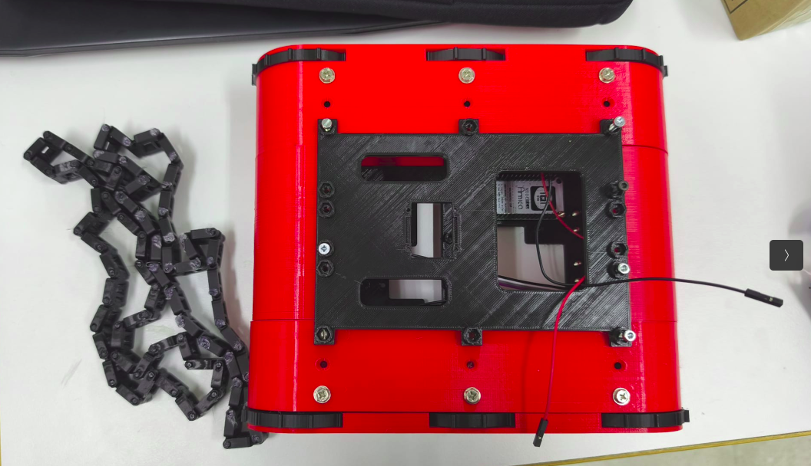

# Proyecto HiroBot
Este proyecto consiste en un robot tanque con el objetivo de ser una plataforma orientada a niños y de aprendizaje de conocimientos de robótica y programación.

## Hardware & Diseño 3D
Actualmente, está montada la base, el tanque, que está basado en el siguiente proyecto: https://www.thingiverse.com/thing:2039843

Además, se está trabajando en el diseño de unas ruedas de oruga compatibles.

Respecto al material hardware utilizado, actualmente contamos con:
 - **Motores DC x2**
 - **Controlador de motores TB6612FNBG**
 - **ESP32** como placa principal en el tanque
 - **ESP8266** como placa utilizada en el mando para teleop
 - **Sensor ultrasonido** para detección de obstáculos
 - **Pantalla OLED Arduino** para comunicación y debug

## Contenido del repositorio
Actualmente en el repositorio se encuentran programas de prueba, tanto de los motores, como de la comunicación entre placas, a falta de mejoras en el código de teleoperación del tanque.

## Futuras líneas
- Completar el diseño de la base y ruedas
- Afinar el movimiento del tanque
- Al hardware se le quiere sumar una cámara tipo una PiCamera o derivados, para añadir percepción del entorno.
- Por otro lado, se quieren probar altavoces y micrófono para que el robot se comunique con los usuarios.